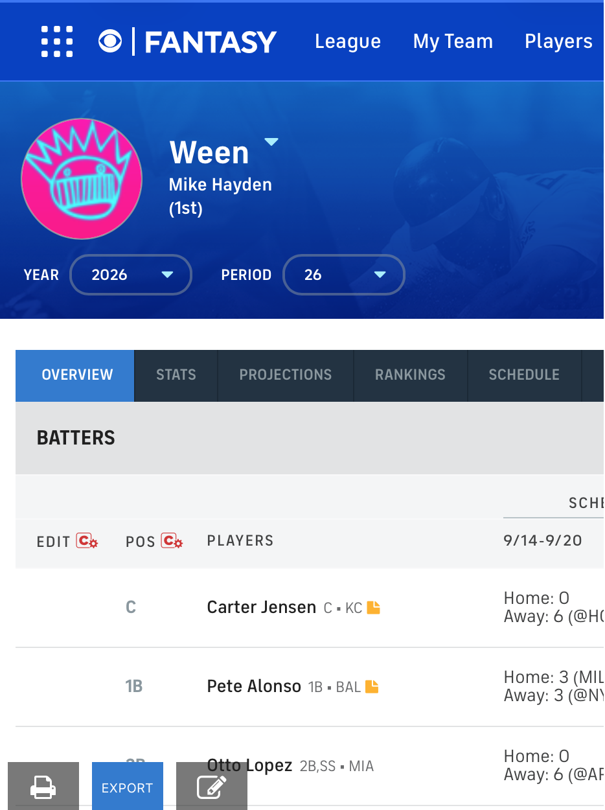

# rummy-wars

A tool to check compliance with roster requirements for the Rummy Wars fantasy baseball league on the CBS Fantasy Baseball platform.

## Installation
 ```
 git clone https://github.com/urbanblight/rummy-wars/
 python3 -m venv .venv/
 source .venv/bin/activate
 python3 -m pip install -r requirements.txt`
```
## Usage

* Log into Rummy Wars on the CBS Fantasy Baseball platform.
* Go to the Roster page for a team and download the CSV export for that team
* Execute `python3 -m main path/to/export.csv` 
<p align="center">
  
</p>

## Sample Output

Console only outputs `INFO` but the `rummy-wars.log` file contains `DEBUG` level messages

```
2026-09-16 18:01:14 | INFO     | main | Successfully loaded 55 players.
2026-09-16 18:01:14 | INFO     | utils | Does not exceed MiLB roster limit: 20
2026-09-16 18:01:14 | INFO     | utils | Does not exceed IL roster limit: 8
2026-09-16 18:01:15 | DEBUG    | utils | Tyler Soderstrom is placed in an Injured slot and is on the IL
2026-09-16 18:01:16 | DEBUG    | utils | Shohei Ohtani is placed in an Injured slot and is on the IL
2026-09-16 18:01:16 | DEBUG    | utils | Shane Bieber is placed in an Injured slot and is on the IL
2026-09-16 18:01:17 | DEBUG    | utils | Number of transactions for Sam Bachman: 42
2026-09-16 18:01:17 | DEBUG    | utils | Number of transactions for Sam Bachman: 42
2026-09-16 18:01:17 | WARNING  | utils | Sam Bachman is placed in an Injured slot and was activated 2026-09-16
2026-09-16 18:01:18 | DEBUG    | utils | Carlos Estevez is placed in an Injured slot and is on the IL
2026-09-16 18:01:19 | DEBUG    | utils | Cody Ponce is placed in an Injured slot and is on the IL
2026-09-16 18:01:20 | DEBUG    | utils | A.J. Puk is placed in an Injured slot and is on the IL
2026-09-16 18:01:21 | DEBUG    | utils | Kirby Yates is placed in an Injured slot and is on the IL
2026-09-16 18:01:21 | DEBUG    | utils | Ike Irish is currently on an MiLB team.
2026-09-16 18:01:22 | DEBUG    | utils | Tre' Morgan is currently on an MiLB team.
2026-09-16 18:01:22 | DEBUG    | utils | Dauri Fernandez is currently on an MiLB team.
2026-09-16 18:01:23 | DEBUG    | utils | Mitch Voit is currently on an MiLB team.
2026-09-16 18:01:23 | DEBUG    | utils | Wehiwa Aloy is currently on an MiLB team.
2026-09-16 18:01:24 | DEBUG    | utils | Coy James is currently on an MiLB team.
2026-09-16 18:01:25 | WARNING  | utils | Anthony Volpe is in a Minors slot but has more than 130 AB (1911). Most recent call up was 2026-09-10
2026-09-16 18:01:26 | DEBUG    | utils | Jaden Fauske is currently on an MiLB team.
2026-09-16 18:01:26 | DEBUG    | utils | Nick Morabito All-Time MLB AB: 29
2026-09-16 18:01:27 | DEBUG    | utils | Paulino Santana is currently on an MiLB team.
2026-09-16 18:01:28 | DEBUG    | utils | Junior Perez is currently on an MiLB team.
2026-09-16 18:01:28 | DEBUG    | utils | Kevin Alvarez is currently on an MiLB team.
2026-09-16 18:01:28 | DEBUG    | utils | Josue Briceno is currently on an MiLB team.
2026-09-16 18:01:29 | DEBUG    | utils | Andrew Salas is currently on an MiLB team.
2026-09-16 18:01:30 | DEBUG    | utils | Unable to match CBS name 'Dorian Soto' to MLB player
2026-09-16 18:01:30 | DEBUG    | utils | Colby Thomas is currently on an MiLB team.
2026-09-16 18:01:31 | WARNING  | utils | Ryan Waldschmidt is in a Minors slot but has more than 130 AB (248). Most recent call up was 2026-07-10
2026-09-16 18:01:32 | DEBUG    | utils | Jett Williams is currently on an MiLB team.
2026-09-16 18:01:32 | DEBUG    | utils | Jake Bloss is currently on an MiLB team.
2026-09-16 18:01:33 | DEBUG    | utils | Kai-Wei Teng is currently on an MiLB team.
2026-09-16 18:01:33 | INFO     | main | Roster may be compliant with evaluated rules, but check any warnings above.
```